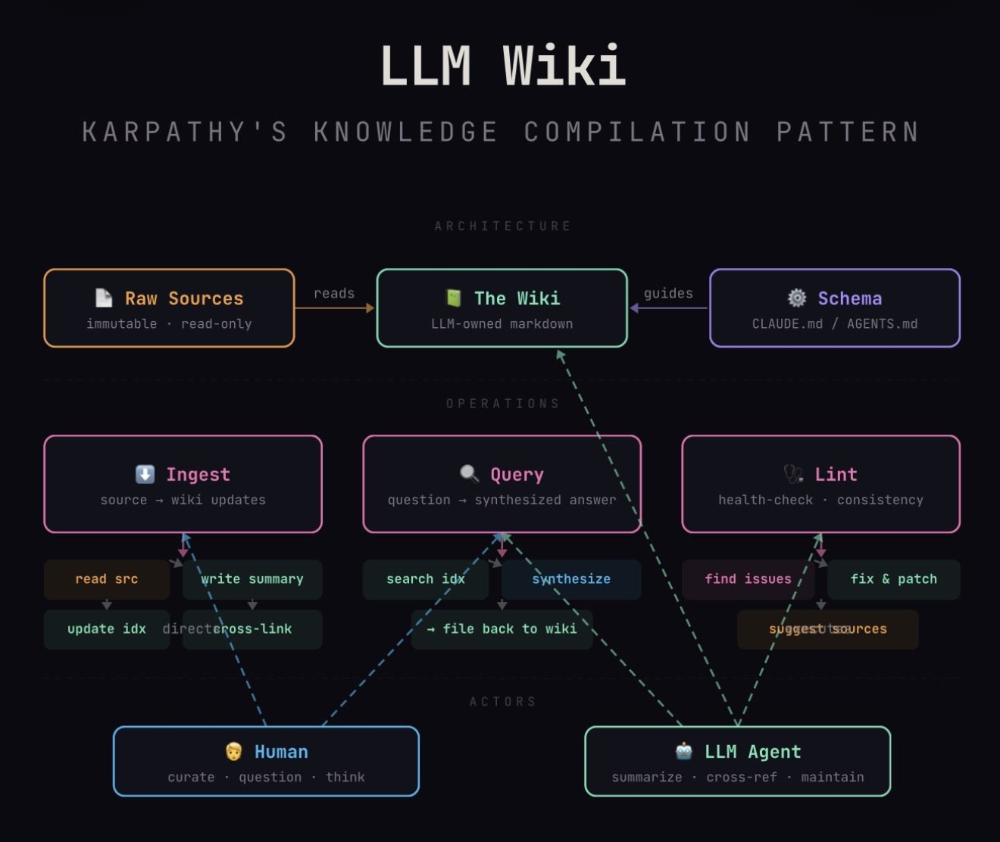

# LLM Wiki

A personal knowledge base built and maintained by LLM agents. Based on [Andrej Karpathy's LLM Wiki pattern](https://gist.github.com/karpathy/442a6bf555914893e9891c11519de94f).

> This repository was created for the **Diligent AI Ops Hackathon 2026**. For the original hackathon framing, motivation, and architecture overview, see [`docs/hackathon-brief.md`](docs/hackathon-brief.md).

Live topics in this repo:

- [`topics/amsterdam/`](topics/amsterdam/) — Amsterdam & Netherlands travel wiki (11 sources in 4 languages → 52 wiki pages)
- [`topics/berkshire-hathaway/`](topics/berkshire-hathaway/) — Buffett's shareholder letters distilled into an investor education wiki (49 sources → 149 wiki pages)
- [`topics/rheinmetall/`](topics/rheinmetall/) — Rheinmetall AG corporate intelligence wiki (12 sources — annual reports and earnings call transcripts → 35 wiki pages)



## How It Works

1. **You** curate raw sources (articles, papers, notes, images) into `topics/<slug>/raw/`
2. **The LLM** processes sources into a structured, interlinked wiki at `topics/<slug>/wiki/`
3. **You** browse the wiki in Obsidian (or VS Code, Cursor, GitHub), ask questions, and direct the analysis
4. **The LLM** keeps everything cross-referenced, consistent, and up to date

The wiki is a **persistent, compounding artifact**. Knowledge is compiled once and kept current - not re-derived on every query.

## Use Cases

The LLM Wiki works for any domain where you accumulate knowledge over time and want it organized. Some examples:

- **Research deep-dives** — Going deep on a topic over weeks or months. Papers, articles, and notes are ingested incrementally. By the end, you have a structured, cross-referenced knowledge base with an evolving thesis — not scattered highlights across 40 PDFs.
- **Engineering initiative knowledge base** — Feed PRDs, architecture docs, investigation notes, and decision records into the wiki. The LLM cross-references requirements against architecture decisions, flags contradictions when specs change, and builds a structured context base that AI coding agents can read directly when implementing features.
- **Trip planning** — Clip travel blogs, hotel sites, and attraction pages in any language. The wiki cross-references recommendations, extracts prices and hours, and organizes by place, theme, and practical concern. The Amsterdam topic synthesized 11 sources in 4 languages into a 52-page travel guide.
- **Corporate analysis / due diligence** — Feed annual reports, earnings transcripts, and filings into the wiki. The LLM extracts financial time-series, tracks management guidance vs. actuals, flags contradictions between reports, and builds entity profiles. The Rheinmetall topic in this repo turned 12 dense PDFs (~3,000 pages) into 35 interlinked analysis pages.
- **Investor research** — Process years of shareholder letters, 10-Ks, or analyst reports. Principles, case studies, and financial trends compound across sources. The Berkshire topic distilled 49 Buffett letters into 149 pages of investment principles, case studies, and financial analysis — cross-referenced across 49 years.
- **Competitive intelligence** — Track competitors, market trends, and product launches over time. Monthly snapshots become sources; the wiki synthesizes cross-competitor comparisons, surfaces trends, and flags changes automatically.
- **Learning / book reading** — Filing each chapter, building pages for characters, themes, and concepts. By the end, you have a rich companion wiki (think fan wikis like Tolkien Gateway — built automatically).

For more use cases and deeper context, see [`docs/pattern-overview.md`](docs/pattern-overview.md).

## Getting Started

### Prerequisites

- An LLM agent with filesystem access (VS Code + GitHub Copilot, Claude Code, Cursor, etc.)
- [Obsidian](https://obsidian.md/) for browsing the wiki (optional but recommended — see [Obsidian Setup](#obsidian-setup))
- Git for version history

> "Obsidian is the IDE; the LLM is the programmer; the wiki is the codebase." - Andrej Karpathy

### First Steps

1. Open this folder in your LLM agent environment
2. Optionally, open this folder as an [Obsidian](https://obsidian.md/) vault for graph-view browsing (see [Obsidian Setup](#obsidian-setup))
3. Tell the agent: _"Create a new topic called `my-topic` about `<what you want to research>`"_ (runs the [`init-topic`](.claude/skills/init-topic/SKILL.md) skill). Optionally provide 2-3 example sources — the agent will analyze them and propose a wiki structure tailored to your domain
4. The agent will help you choose a wiki layout, then create the full directory tree and topic config
5. Drop source files into `topics/my-topic/raw/` (or a subfolder if your topic uses one)
6. Tell the agent: _"Ingest"_ (runs the [`ingest`](.claude/skills/ingest/SKILL.md) skill) — it will find unprocessed sources, create summaries, and build/update wiki pages
7. Ask the agent questions: _"What do we know about X?"_ or _"Compare X and Y"_ — it searches the wiki and synthesizes answers, optionally filing them as new pages. Because the wiki is pre-compiled, answers are grounded in structured, cross-referenced knowledge — not raw document search
8. Repeat steps 5-7 as you add more sources. The wiki compounds — each new source enriches existing pages

Explore the existing topics (`amsterdam`, `berkshire-hathaway`, `rheinmetall`) to see what a populated wiki looks like before creating your own.

## Structure

Every topic follows the same skeleton — `TOPIC.md` + `raw/` + `wiki/` — but both `raw/` and `wiki/` subfolders are domain-specific:

```
topics/<slug>/
├── TOPIC.md                 # Purpose, raw layout, wiki layout, page conventions, key questions
├── raw/                     # Your sources (immutable once sorted)
│   └── ...                  # Flat by default; subfolders when declared in TOPIC.md
├── originals/               # Binary originals of converted sources (e.g. PDFs); never ingested
└── wiki/                    # LLM-generated (don't edit manually)
    ├── index.md             # Master catalog
    ├── log.md               # Activity timeline
    ├── overview.md          # Topic overview (optional)
    ├── sources/             # One summary per raw source
    └── <layout folders>/    # Domain-specific (see below)
```

The `init-topic` skill helps you choose **both** a raw layout and a wiki layout fitted to your domain.

**Raw layout defaults** to flat (all sources in `raw/` root) — but topics can declare subfolder layouts in `TOPIC.md` when source types are diverse (e.g., `competitor-snapshots/`, `analytics-exports/`, `prds/`). The agent scans whatever subdirectories actually exist on disk.

**Wiki layout defaults** are `concepts/`, `entities/`, `syntheses/`, `questions/` — but topics can declare a custom layout in `TOPIC.md`:

| Topic                | Layout                                                                   | Why                                                         |
| -------------------- | ------------------------------------------------------------------------ | ----------------------------------------------------------- |
| `amsterdam`          | `places/`, `themes/`, `practical/`, `hotels/`                            | Travel wiki — organized by what you'd look up               |
| `berkshire-hathaway` | `principles/`, `entities/`, `case-studies/`, `financials/`, `questions/` | Investor education — principles taught through case studies |
| `rheinmetall`        | `entities/`, `concepts/`, `financials/`, `comparisons/`, `questions/`    | Corporate analysis — dedicated financial pages              |

## Operations

Four operations cover the full lifecycle: **create → build → maintain → use**.

| Command        | Skill                                              | What happens                                                                                             |
| -------------- | -------------------------------------------------- | -------------------------------------------------------------------------------------------------------- |
| **Init Topic** | [`init-topic`](.claude/skills/init-topic/SKILL.md) | **Create** — _"New topic about X"_ — helps choose a wiki layout, creates directory structure + config    |
| **Ingest**     | [`ingest`](.claude/skills/ingest/SKILL.md)         | **Build** — _"Process this source"_ — reads it, creates summary, updates wiki pages, updates index & log |
| **Lint**       | [`lint`](.claude/skills/lint/SKILL.md)             | **Maintain** — _"Health check"_ — finds contradictions, orphans, broken links, stale content             |
| **Query**      | [`query`](.claude/skills/query/SKILL.md)           | **Use** — _"What do we know about X?"_ — searches wiki, synthesizes answer, optionally files it          |

Each operation has a detailed skill file in `.claude/skills/` with step-by-step workflows, edge cases, and gotchas.

## Schema

The LLM's instructions live in:

- `AGENTS.md` - Wiki structure, page types, conventions, quality standards (VS Code Copilot, primary)
- `CLAUDE.md` - Quick reference (Claude Code, references AGENTS.md)
- `.claude/skills/` - Operational workflows (init-topic, ingest, lint, query) with detailed steps and edge cases

## Obsidian Setup

[Obsidian](https://obsidian.md/) is a free markdown editor that opens a folder of `.md` files as an interconnected "vault". It's the recommended way to browse the wiki because it renders links as clickable navigation, shows a graph view of how pages connect, and updates in real time as the LLM edits files. Karpathy: _"Obsidian is the IDE; the LLM is the programmer; the wiki is the codebase."_

### Opening the vault

1. Download and install [Obsidian](https://obsidian.md/)
2. On the vault chooser screen, click **"Open folder as vault"** and select this repository's root folder (`dil-ai-ops-hackathon-2026/`)
3. That's it. You'll see the full folder tree in the left sidebar

**Use a single vault at the repo root.** This gives you visibility into all topics, the README, and schema files in one place. Obsidian handles subfolders well, and the graph view works across all topics.

### Recommended plugins

- **Graph view** (built-in) - Shows wiki structure and connections. Hover over nodes to see what links where. Exclude `raw/` from the graph if it gets noisy (Settings > Files & Links > Excluded files)
- **Dataview** (community plugin) - Runs queries over page frontmatter. Since all wiki pages have YAML frontmatter (tags, dates, source counts), Dataview can generate dynamic tables and lists. Example: list all concept pages sorted by source count
- **Marp** (community plugin) - Renders markdown-based slide decks. Useful for generating presentations from wiki content

### Obsidian Web Clipper

[Obsidian Web Clipper](https://obsidian.md/clipper) is a browser extension (Chrome, Firefox, Edge, Safari) that converts any web page to a clean markdown file and saves it directly into your vault. It's the fastest way to get sources into `raw/`.

**How to use:**

1. Install the extension from your browser's extension store
2. Configure it to save files to the right folder (e.g., `topics/<your-topic>/raw/` — or a subfolder if your topic uses one)
3. When you find an article, tweet, or page worth saving: click the extension icon, then "Add to Obsidian" - 2 clicks total
4. The page is saved as a `.md` file in your vault, ready for the agent to ingest

Works well on long-form articles, blog posts, documentation pages, and even Twitter/X threads. The extension extracts clean text content and preserves headings, links, and images.

### Settings tips

- **Attachment folder:** In Settings > Files and links > "Attachment folder path", set it to a fixed directory (e.g., `topics/<your-topic>/raw/assets/` or the media subfolder for your topic's raw layout) so downloaded images land in a predictable place alongside your source files
- **Download images hotkey:** In Settings > Hotkeys, search for "Download attachments for current file" and bind it to a hotkey (e.g., Ctrl+Shift+D). After clipping an article, hit the hotkey to download all images locally - useful for offline access and for giving the LLM access to diagrams

## Further Reading

- [docs/hackathon-brief.md](docs/hackathon-brief.md) - Original hackathon framing, motivation, and 30-second/deep explanations
- [docs/karpathy-gist.md](docs/karpathy-gist.md) - Karpathy's full idea file with reference links (local copy)
- [docs/pattern-overview.md](docs/pattern-overview.md) - Deeper context: the problem, alternatives comparison, use cases, community insights, future directions
- [docs/publishing-options.md](docs/publishing-options.md) - How to publish a wiki as a website: Obsidian Publish vs. Starlight, Docusaurus, GitHub Pages — cost, setup, tradeoffs
- [presentation.md](presentation.md) - Hackathon presentation sketch

## References

- [Karpathy's original gist](https://gist.github.com/karpathy/442a6bf555914893e9891c11519de94f)
- [Original tweet](https://x.com/karpathy/status/2039805659525644595) (April 2, 2026)
- [Follow-up tweet with gist](https://x.com/karpathy/status/2040470801506541998) (April 4, 2026)
- [Yuchen Jin's architecture diagram](https://x.com/Yuchenj_UW/status/2040482771576197377) (April 4, 2026)
